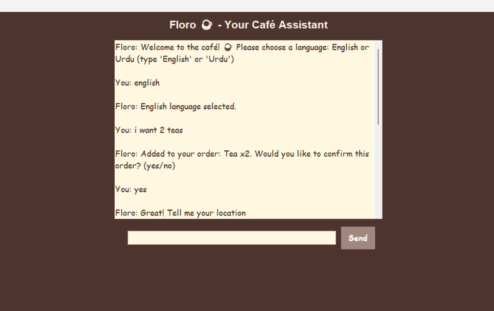
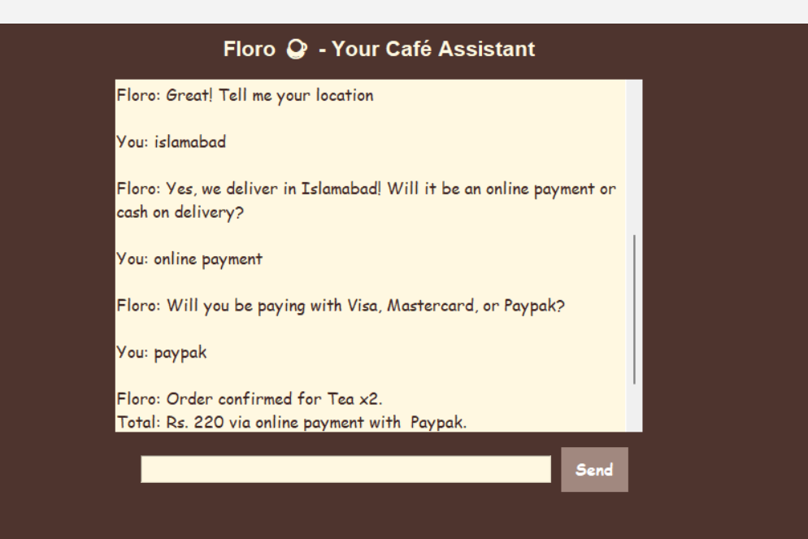

### Floro Café Chatbot
# Overview
Floro is a bilingual (English/Urdu) conversational chatbot designed to automate café order processing, with a primary focus on robust backend logic. Built with Python, PyTorch, and NLTK, it enables users to place orders for tea and coffee, specify delivery locations (Islamabad, Lahore, Karachi), choose payment methods (cash on delivery or online with Visa/Mastercard/Paypak), and query delivery times (20–40 minutes). A functional Tkinter GUI provides a user-friendly interface to interact with the chatbot’s sophisticated backend, which leverages a neural network for natural language understanding (NLU).

# Key Features

Bilingual Support: Processes English and Urdu inputs (e.g., "I want tea" or "mujhe chai chahiye").
Order Management: Handles orders with quantities (e.g., "2 chai") and provides summaries.
Delivery Flow: Validates locations and supports cash or online payments with card type selection.
NLU: Employs a PyTorch model to classify intents (e.g., ordering, delivery queries).
GUI: Tkinter interface with a Mocha brown theme, scrolled chat area, and input field.
Error Handling: Robust against invalid inputs and GUI errors (e.g., _tkinter.TclError).

### Chatbot Interface 1

### Chatbot Interface 2

## Project Structure
nlp_project/
|
├── app.py            # Main Tkinter GUI and chatbot logic
├── chat.py           # Console-based chatbot (predecessor to app1.py)
├── train.py           # Script to train the PyTorch NLU model
├── model.py           # Neural network model definition
├── nltk_utils.py      # NLTK utilities for tokenization and bag-of-words
├── intents.json       # Intent patterns and responses for NLU
├── data.pth           # Trained model weights
└── README.md          # Project documentation

### File Descriptions

app.py: The main application, integrating the Tkinter GUI and chatbot backend. It handles user interactions, processes inputs via NLU, manages order and delivery states, and renders responses in a scrolled chat area. Key components include get_floro_response for backend logic and build_gui for frontend rendering.
chat.py: A console-based version of the chatbot, serving as the predecessor to app1.py. It contains the same backend logic but lacks a GUI, using terminal input/output for testing and development.
train.py: Script to train the PyTorch NLU model. It processes intents.json to create a dataset, trains a neural network (model.py), and saves weights to data.pth.
model.py: Defines the NeuralNet class, a PyTorch neural network with input, hidden, and output layers for intent classification.
nltk_utils.py: Provides NLP utilities, including tokenize (splits text into tokens) and bag_of_words (converts tokens to numerical features for NLU).
intents.json: JSON file containing intent patterns (e.g., "mujhe chai chahiye") and responses (e.g., "Zabardast!") for English and Urdu, used by train.py and app1.py.
data.pth: Stores trained model weights, generated by train.py, loaded by app1.py for NLU.
README.md: This documentation file, detailing setup, usage, and architecture.

### Setup Instructions
# Prerequisites

Python 3.13
Libraries: torch, nltk, tkinter (included with Python)
NLTK data: Run nltk.download('punkt') in Python
(On Windows OS, you might get an error by downloading nltk.download('punkt') only. Add another line nltk.download('punkt_tab') in the train.py if arises) 

# Installation

Clone the repository or copy files to a local directory (e.g., C:\Users\Hp\Documents\nlp_project).
Install dependencies:pip install torch nltk

Ensure intents.json and data.pth are in the project directory.
(Optional) Train the model if data.pth is missing:python train.py

### Running the Application

Navigate to the project directory:cd C:\Users\Hp\Documents\nlp_project  (or wherever you save this on you pc, in your case it might be in downloads unless selected otherwise!)

Run the GUI:python app.py

Select a language (English or Urdu) and interact with the chatbot.

### Architecture
# Backend

FloroChatbot Logic (in app.py):
The core focus, managing state via order_flow (items, total) and delivery_flow (location, payment, card type).
Processes inputs using rule-based logic and NLU for bilingual functionality (e.g., "2 chai" → Tea x2, Rs. 220).

# NLU:
PyTorch neural network (model.py) trained on intents.json.
Classifies intents (e.g., "order_start", "delivery_time") with a bag-of-words model (nltk_utils.py).
Trained weights in data.pth (final loss: 0.0000).  (Due to small dataset)

Intents (intents.json):
Defines patterns and responses for English and Urdu.

# Frontend

Tkinter GUI (app1.py):
A functional interface with a scrolled chat area, input field, and Send button, complementing the backend.
Uses Mocha brown theme (#4E342E) and Comic Sans MS font.
Prevents race conditions with is_processing flag and handles _tkinter.TclError.

# Integration

Communication: Frontend (send_message) calls backend (get_floro_response) to process inputs.
State Management: Backend maintains order_flow and delivery_flow, synced via show_order_summary.
Error Handling: Delayed root.destroy() ensures smooth exit.

### Core Code Snippets
Below are key code excerpts illustrating the chatbot’s functionality, with explanations.
1. GUI Setup (app1.py)
Sets up the Tkinter interface with a chat area and input field.
def build_gui(self):
    header = tk.Label(self.root, text="Floro ☕ - Your Café Assistant",
                     font=("Arial", 16, "bold"), bg=BG_COLOR, fg=CHAT_BG)
    header.pack(pady=10)
    self.chat_area = scrolledtext.ScrolledText(self.root, wrap=tk.WORD, width=50, height=15,
                                              font=FONT, bg=CHAT_BG, fg=TEXT_COLOR, bd=0, relief="flat")
    self.chat_area.pack(padx=10, pady=5)
    self.chat_area.config(state=tk.DISABLED)
    self.entry_frame = tk.Frame(self.root, bg=BG_COLOR)
    self.entry_frame.pack(pady=10)
    self.user_input = tk.Entry(self.entry_frame, width=40, font=FONT, bg=CHAT_BG, fg=TEXT_COLOR)
    self.user_input.grid(row=0, column=0, padx=10)
    self.user_input.bind("<Return>", self.send_message)
    send_btn = tk.Button(self.entry_frame, text="Send", bg=BUTTON_COLOR, fg="white",
                        font=("Comic Sans MS", 12, "bold"), bd=0, padx=10, pady=5,
                        command=self.send_message)
    send_btn.grid(row=0, column=1)

Explanation: Creates a Tkinter window with a header, scrolled chat area (ScrolledText), input field (Entry), and Send button. The Mocha brown theme (BG_COLOR) ensures visual consistency. The <Return> binding and is_processing flag (not shown) prevent race conditions.
2. NLU Processing (app1.py)
Classifies user intents using the PyTorch model.
# In get_floro_response
tokens = tokenize(sentence)
X = bag_of_words(tokens, self.all_words)
X = X.reshape(1, X.shape[0])
X = torch.from_numpy(X).to(self.device)
output = self.model(X)
_, predicted = torch.max(output, dim=1)
tag = self.tags[predicted.item()]
probs = torch.softmax(output, dim=1)
prob = probs[0][predicted.item()]
if prob.item() > 0.5:
    self.last_tag = tag
    for intent in self.intents["intents"]:
        if tag == intent["tag"]:
            response_obj = random.choice(intent["responses"])
            if isinstance(response_obj, dict):
                response = response_obj.get(self.language, "Sorry, I don't have a response.")
            else:
                response = response_obj
            # ... (handle specific intents like order_start) ...

Explanation: Tokenizes input (e.g., "mujhe chai chahiye"), converts to a bag-of-words vector, and feeds it to the PyTorch model. Predicts an intent (e.g., "order_start") with confidence (prob > 0.5) and selects a response from intents.json. This enables bilingual intent classification.
3. Order Processing (app1.py)
Handles order inputs with quantities.
# In get_floro_response, for order_start intent
matches = re.findall(r'(\d+)?\s*(cups? of)?\s*(tea|coffee|chai)', sentence.lower())
if not matches:
    matches = [(None, None, word) for word in ["tea", "coffee", "chai"] if word in sentence.lower()]
for quantity, _, item in matches:
    item = "tea" if item == "chai" else item.lower()
    quantity = int(quantity) if quantity else 1
    if item in self.item_prices:
        self.order_flow["items"][item] = self.order_flow["items"].get(item, 0) + quantity
        self.order_flow["total"] += self.item_prices[item] * quantity
if self.order_flow["items"]:
    items_summary = ", ".join([f"{itm.capitalize()} x{q}" for itm, q in self.order_flow["items"].items()])
    response = f"{'Added to your order: ' if self.language == 'english' else 'Apkay order mein shamil: '}{items_summary}. {'Would you like to confirm this order? (yes/no)' if self.language == 'english' else 'Kya aap yeh order confirm karna chahte hain? (yes/no)'}"

Explanation: Uses regex to extract quantities and items (e.g., "2 chai" → Tea x2). Updates order_flow with items and total cost (Tea: Rs. 110, Coffee: Rs. 180). Generates a bilingual confirmation prompt, syncing state with the frontend.
4. Neural Network Definition (model.py)
Defines the PyTorch model for NLU.
import torch.nn as nn

class NeuralNet(nn.Module):
    def __init__(self, input_size, hidden_size, num_classes):
        super(NeuralNet, self).__init__()
        self.l1 = nn.Linear(input_size, hidden_size)
        self.l2 = nn.Linear(hidden_size, hidden_size)
        self.l3 = nn.Linear(hidden_size, num_classes)
        self.relu = nn.ReLU()
    
    def forward(self, x):
        out = self.l1(x)
        out = self.relu(out)
        out = self.l2(out)
        out = self.relu(out)
        out = self.l3(out)
        return out

Explanation: Defines a three-layer feedforward neural network with ReLU activation. input_size is the bag-of-words vector length, hidden_size is configurable (e.g., 8), and num_classes is the number of intents. Used by train.py and app1.py.
5. Intent Sample (intents.json)
Defines patterns and responses for NLU.
{
  "intents": [
    {
      "tag": "delivery_time",
      "patterns": [
        "How long does delivery take?",
        "How long will it take?",
        "kitni dair lagy gi?",
        "itni dair?"
      ],
      "responses": [
        {
          "english": "Delivery takes 20 - 40 minutes.",
          "urdu": "Delivery mein 20 - 40 minutes lagtay hain."
        }
      ]
    }
  ]
}

Explanation: Specifies patterns for the delivery_time intent and bilingual responses. Loaded by train.py to create the dataset and by app1.py to generate responses.
Usage Guide

# Start the Application:

Run python app1.py to launch the GUI.
Select a language by typing "English" or "Urdu".

# Place an Order:

Example (Urdu):You: Urdu
Floro: Urdu zuban chuni gayi hai.
You: mujhe 2 chai chahiye
Floro: Apkay order mein shamil: Tea x2. Kya aap yeh order confirm karna chahte hain? (yes/no)
You: yes
Floro: Zabardast! Apna address batayein
You: Islamabad
Floro: Jee haan, hum Islamabad mein deliver karte hain! Online payment ya cash on
delivery?
You: online payment
Floro: Kya aap Visa, Mastercard, ya Paypak se karenge?
You: Visa
Floro: Order confirm hua: Tea x2.
Kul: Rs. 220 ke zariye online payment Visa.
Apka order Islamabad ko deliver hoga! Shukriya!
You: kitni dair lagy gi?
Floro: Delivery mein 20 - 40 minutes lagtay hain.
You: close
Floro: Khuda hafiz!

# View Order Summary:

Type "summary" or "kitna order kiya" to see details.

# Handle Invalid Inputs:

Invalid location:You: faisalabad deliver karte ho?
Floro: Maaf kijiye, hum sirf Islamabad, Lahore, aur Karachi mein deliver karte hain.
You: faisalabad nahi hai?
Floro: Maaf kijiye, hum ab bhi sirf Islamabad, Lahore aur Karachi mein deliver karte hain. Inme se kisi ke liye order karna chahte hain?

# Future Improvements

Web Frontend: Replace Tkinter with Flask for accessibility.
Backend API: Expose FloroChatbot as a REST API.
Enhanced NLU: Improve Urdu tokenization with indic-nlp-library.
GUI Enhancements: Add Clear and Reset buttons.
Database: Store orders in SQLite.

# Contributing

Contact the developer for issues or suggestions.
Fork the repository and submit pull requests.

# License
MIT License.

# Acknowledgments
Built with Python, PyTorch, NLTK, and Tkinter.
Inspired by bilingual customer service in Pakistan.

